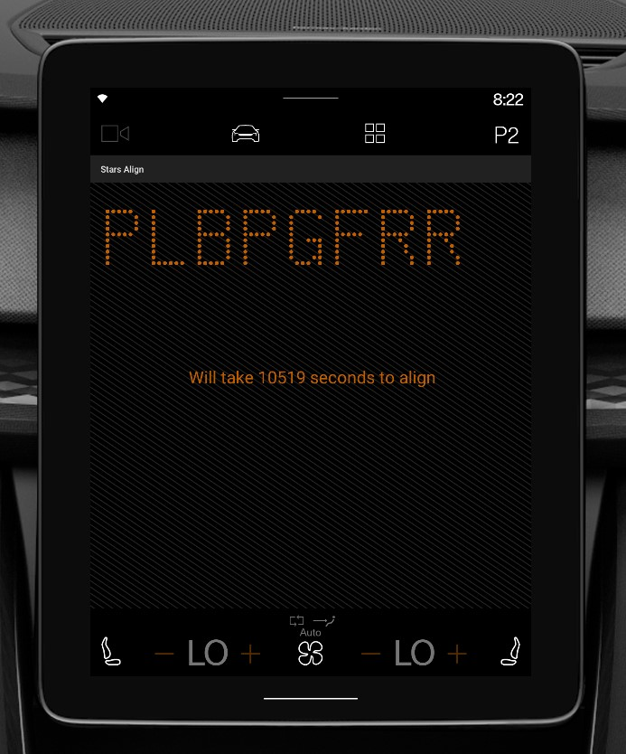

# Stars Align - Advent of Code 2018, Day-10

**Stars Align** is a solution for a puzzle in [Advent of code 2018 Day 10](https://adventofcode.com/2018/day/10) challenge.
This is an android based application powered by Polestar skin.

Here the solution is divided into two parts where one is finding the time(in seconds) and another is to find the text behind the points by ploting.
For this solution I used input(points) received from Adevent of code, and the output plotted in Canvas layer

Expected answer is **PLBPGFRR** at **10519** seconds

### Flash for splash
|  |

### Screenshot
|  |