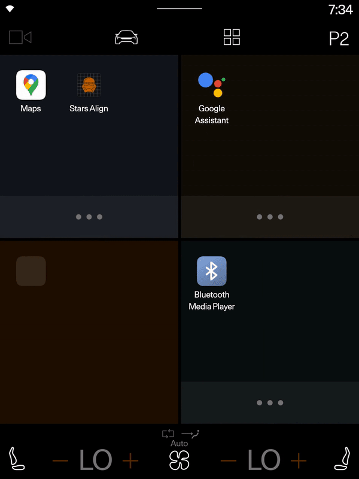

# Stars Align - Advent of Code 2018

**Stars Align** is a solution for a puzzle in [Adevent of code 2018 Day 10](https://adventofcode.com/2018/day/10) challenge.
This is an android based application powered by Polestar skin.

Here the solution is diveded in to two where one is finding the time to align in seconds and second is ploting the data to find the text behind the points.

For this solution I used input(points) received from Adevent of code.

Expected answer is PLBPGFRR at 10519 seconds

## Flash for splash
|  |

